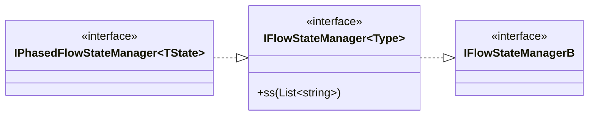
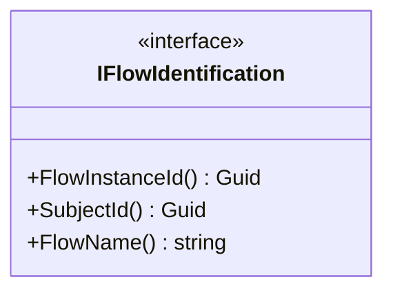
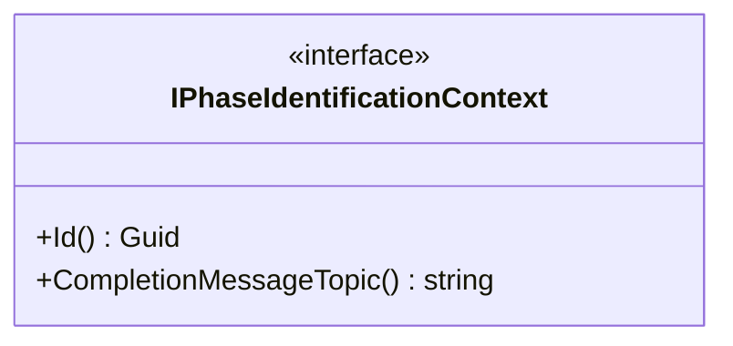

# Deklarace Interface

IFlowStateManager a zděděné rozhraní/třídy slouží pro práci s FlowStateModel<TModel>, hlavně pro načítání/ukládání modelu do databáze. 

## Důležité třídy / rozhraní IFlowStateManager ...

Rozhraní je implementováno třídou FlowStateManager\<TState\>.

### TODO:
- V metodě ResetCreateStateAsync se zbytečně znova inicializuje **stateModel.State = new TState();** 
- Proceduru **AssertStateLoaded** lze označit Attributem **[MemberNotNull(nameof(StateModel))]**

- IFlowIdentification - slouží pro identifikaci Flow

- IPhaseIdentificationContext - slouží k identifikace fáze  

## Důležité třídy / rozhraní IPhasedFlowStateManager\<State\>

	public interface IPhasedFlowStateManager<TState> : IFlowStateManager<TState>    
    where TState : class, new()  
	{  
	  List<PhaseDefinition> NavigationStack { get; set; }  
	  PhaseDefinition? CurrentNavigationPhase { get; set; }  
	  bool IsCurrentPhaseInitialized { get; set; }  
	  bool IsBackEvent { get; set; }  
	}

<!--stackedit_data:
eyJoaXN0b3J5IjpbNzMyNzI2MTUzLC0xNjkzMTQ4MjcxLDIxNT
QxOTQxLDIxMjM4MDIyMzEsMjEyMzgwMjIzMSw3NzMyODk3OSwt
MTAwMzQxOTI4NSwyMDg3MDQ4ODc4LC0xNDA1OTU2OTRdfQ==
-->