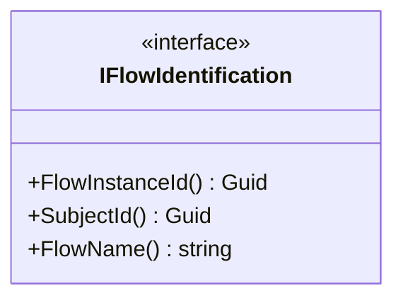
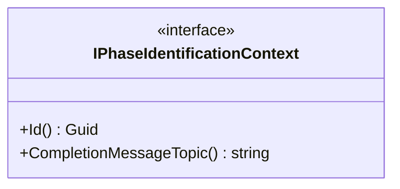

# Deklarace Interface

IFlowStateManager a zděděné rozhraní/třídy slouží pro práci s FlowStateModel<TModel>, hlavně pro načítání/ukládání modelu do databáze. 

```mermaid
classDiagram
    direction LR
    IPhasedFlowStateManager~TState ..|> IFlowStateManager~TState~
    IFlowStateManager~Type~ ..|> IFlowStateManagerB 
    class IFlowStateManager~Type~ {
    <<interface>>
    +ss(List~string~)
    }
    class IPhasedFlowStateManager~TState~ {
    <<interface>>
    }
    class IFlowStateManagerB {
    <<interface>>    
    }
```

## Důležité třídy / rozhraní IFlowStateManager ...

- IFlowIdentification - slouží pro identifikaci Flow



- IPhaseIdentificationContext - slouží k identifikace fáze
  


Hello
```mermaid

```
<!--stackedit_data:
eyJoaXN0b3J5IjpbMTkxOTIxMTM3NywtMTQwNTk1Njk0XX0=
-->