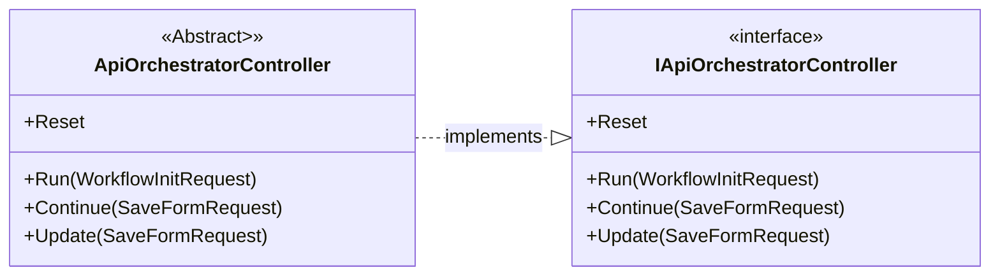
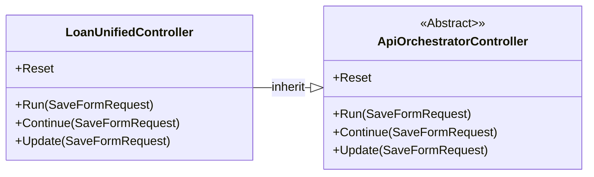
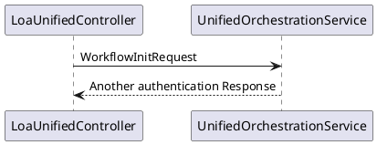

# Základní stavební kameny

Implementace je v projektu [dotnet-workflow - Repos (azure.com)](https://dev.azure.com/hci-iap/koyal/_git/dotnet-workflow)

Základní kámen jsou třída ApiOrchestratorController.cs, která implementuje metody Run, Continue, Update a Reset

Run - spustí workflow a načte aktuální stav. Spustí nové workflow, pokud žádné neexistuje

Continue - zpracovává hodnoty z dynamic form a vrací nový formulář ke zpracování 

Update - updatuje workflow bez pokračování (nic se nerenderuje). Slouží v podstatě pro update stavu WF ze zadaných hodnot  v aktuálním formuláři.

Reset - resetuje WF stav. Prozatím nevím, co to dělá.

Diagram:

Tříde ApiOrchestratorController je použita v [hcd-loan-origination-unified]([hcd-loan-origination-unified - Repos (azure.com)](https://dev.azure.com/hci-iap/koyal/_git/hcd-loan-origination-unified)) projektu.

Třída **LoaUnifiedController** nastavuje Route na *v2/multiworkflow/loan-unified*

Po přijetí requestu předává ApiOrchestratorController okamžite kontrolu třídě implementující **IOrchestrationService**. Ta je v projetku LoanOrigination implementována třídou **UnifiedOrchestrationService**.

