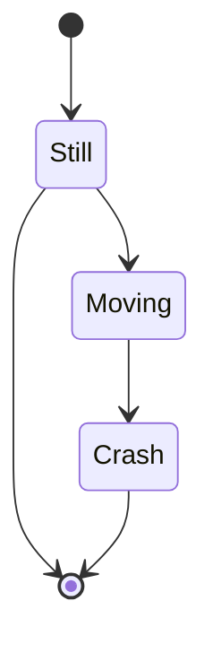
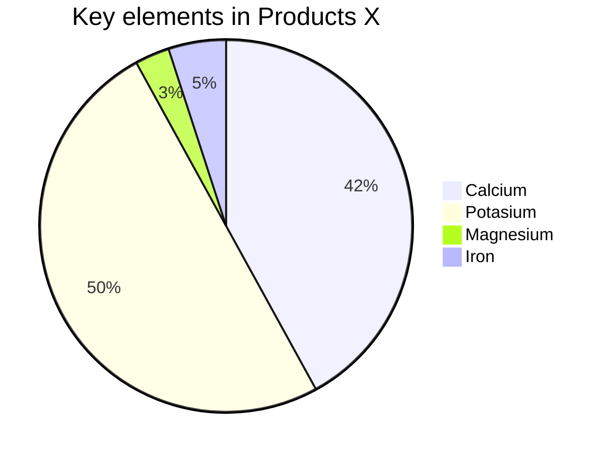
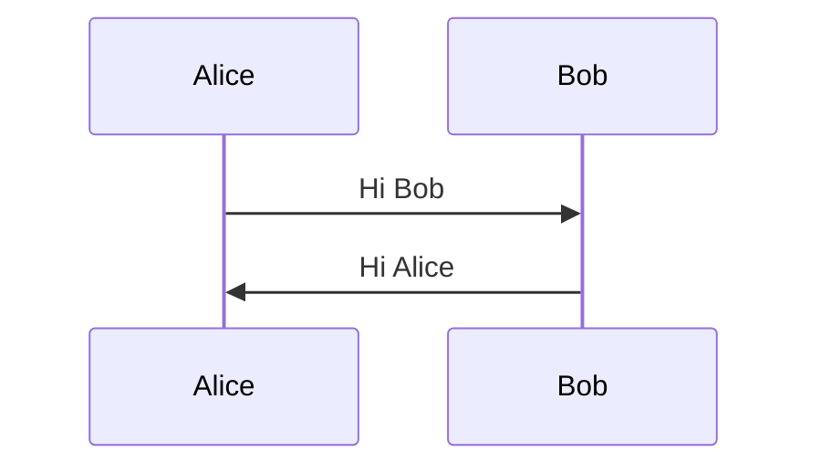

# MongoDB Quick quide

## Commands for mongosh

### List of mongo's databases

```
show dbs/databases
```

### List of database collections

```
show collections/tables
```

### Switch/create to the database

```
use dbname - create or "switch" database
```

### Insert record into collection

db.colectionName.insertOne() where collectionName will be replaced with our collection name. 

```
db.users.insertOne({name: "John", age: 30})
```

```
db.users.insertMany([{name: "Jarek", age: 33},{name: "Natka", age: 34}])
```

### Find record in collect

db.users.find - find documents in collectio

```
db.users.find()
```

db.users.find().limit(2) - return only 2 rows from search

```
db.users.find().limit(2)
```

#### Parameters for find method

Search all records with name "Jarek"

```
db.users.find({name: "Jarek"})
```

Search all rows with name "Jarek" and return only name from object

```
db.users.find({name: "Jarek"},{name: 1})
```

Search all rows with name "Kamil" and return all "columns" except name

```
db.users.find({name: "Kamil"}, { name: 0})
```

#### Complex queries

Search all users with name equal "Jarek"

```
db.users.find({name: {$eq: "Jarek"}})
```

Search all users with name not equal "Jarek"

```
db.users.find({name: {$ne: "Jarek"}})
```

Search all users with age greather or equal to 33

```
db.users.find({age: {$gte: 33}})
```

Search all users with name in ("Petr", "Natka")

Oposite for **\$in** is **\$nin**

```
db.users.find({name: {$in: ["Petr","Natka"]}})
```

Search all users with existing surname field

```
db.users.find( {surname: { $exists: true }})
```

Search all users with age > 30 and age <= 34

```
db.users.find( {age: { $gt: 30, $lte: 34 }})
```

Search all users with age > 30 and age <= 34 and name = "Natka"

```
db.users.find( {age: { $gt: 30, $lte: 34 }, name: "Natka" })
```

Search all users with age = 34 **and** name = "Roman"

```
db.users.find({ $and: [{ age: 34}, {name: "Roman" } ] })
```

Search all users with age = 34 **and** name <> "Roman"

```
db.users.find({ $and: [{ age: 34}, {name: { $ne: "Roman" }} ] })
```

Search all users with age = 34 **or** name = "Roman"

```
db.users.find({ $or: [{ age: 34}, {name: "John" } ] })
```

Search all users with not age <= 32. This is equal as age > 32 ... 

```
db.users.find({ age: { $not: {$lte: 32 }}})
```

Search all users with debt > balance.  Beware to \$ sign on debt and balace. This says "use column value" otherwise "debt" is considered as value.

```
db.users.find( { $expr: { $gt: ["$debt", "$balance"] }})
```

```
db.users.find( { $expr: { $gt: ["debt", "balance"] }}) --> this is wrong  
```

Search all users with addres number 779

```
db.users.find({"adresa.cislo": 779})
```

Search **first** user with age = 33

```
db.users.findOne({age: 33 })
```

Count documents with age = 33

```
db.users.countDocuments({age: 33})
```


### Sort result

Command find all rows and then sort result by name asc

```
db.users.find().sort({name: 1})
```

Command find all rows and then sort result by name desc

```
db.users.find().sort({name: -1})
```


### Skip and limit

skip() - skip first n rows

limit() - get n rows

```
db.users.find().sort({age: -1}).skip(1).limit(2)
```


# Updating data

Update one record. 

Find object wit id and set age to 47

```
db.users.updateOne({_id: ObjectId("62123f0df50f9456810cd853")}, {$set: {age: 47}} )
```

Update one record. Find object with id 62123f0df50f9456810cd853

and increment age with value 1

```
db.users.updateOne({_id: ObjectId("62123f0df50f9456810cd853")}, {$inc: {age: 1}} )
```

Renaming column.

```
db.users.updateOne({_id: xyz}, {$rename: {name: "name2"}} )
```

Remove column from document.

```
db.users.updateOne({_id: xyz, { $unset: {oci: ""}})
```

Insert value into array. 

before: hobbies: [ 'Programing', 'Sport' ]

after: hobbies: [ 'Programing', 'Sport', 'Swimming' ]

```
db.users.updateOne({_id: xyz}, { $push: {hobbies: "Swimming"}})
```

Remove value from array.

before: hobbies: [ 'Programing', 'Sport', 'Swimming' ]

after:  hobbies: [ 'Programing', 'Sport' ]

```
db.users.updateOne({_id: xyz}, { $pull: {hobbies: "Swimming"}})
```

Remove address from every document with address set.

```
db.users.updateMany({adresa: {$exists: true}}, {$unset: {adresa: ""}} )
```

Add hobbies attribute to all documents where hobbies does not exist and set it to "None"

```
db.users.updateMany({hobbies: {$exists: false}}, {$set: { hobbies: ["None"]}} )
```

# Replacing data

Find the first document with the name "Karlos" and replace them with new document.

New document is {name: "Karlosek"}

```
db.users.replaceOne({name: "Karlos"}, {name: "Karlosek"})
```

# Deleting data

Delete firts document with name = "Karlosek"

```
db.users.deleteOne({name: "Karlosek"})
```

Delete all documents with missing field age. 

```
db.users.deleteMany({age: { $exists: false }})
```


---

# Grafy






